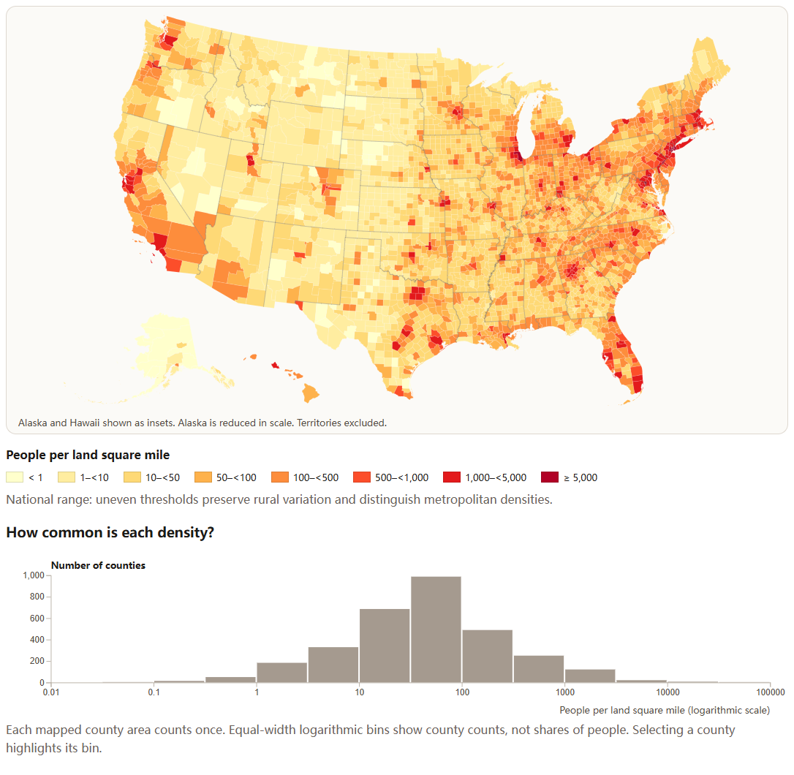
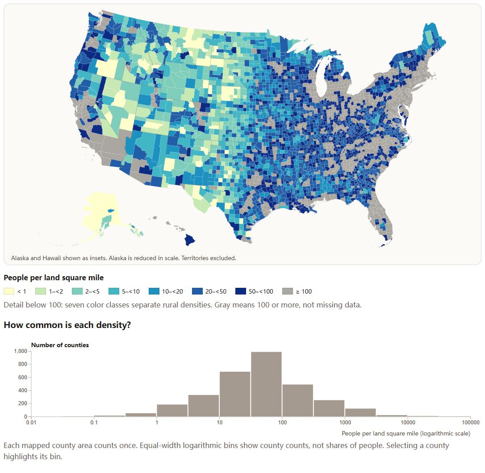

# Visualization Critique and Redesign

## Original visualization and context

TIME's *Where America Lives*, credited to Feilding Cage, presents population density as a landscape of red peaks. The supplied screenshot labels itself “This Is Where We Live” and states that 80% of the U.S. population lives in metropolitan areas. I treat this as the original graphic's historical annotation, not a statistic established by my redesign. Its publication date, data year, and precise spatial unit are unverified; the source page's 2019 copyright footer does not establish them.

The intended audience is the general public. The main message is concentration: metropolitan clusters and eastern urban corridors contrast with sparsely populated areas, especially in the interior West. Likely tasks include recognizing this pattern, locating major centers, and comparing broad regions. The source invites interaction, but its Flash implementation no longer provides a usable basis for testing the original controls.

## Critique

Two strengths support the message. First, prominent red peaks establish a strong visual hierarchy: viewers notice dense centers before reading annotations. Second, geographic position and city labels connect an abstract quantity to familiar places. Height and color reinforce concentration, while the legend signals a highly skewed range. This memorable presentation suits a public-facing news graphic.

Three weaknesses limit analytical tasks. First, perspective and overlapping spikes obscure nearby locations. Height carries magnitude, but apparent shape and occlusion complicate comparisons. A flat geographic view removes that obstruction, although color alone still cannot communicate precise differences.

Second, the tallest peaks dominate attention and sparse regions appear nearly flat. Counties with meaningfully different rural densities are difficult to distinguish. Expanding the color resolution below a stated threshold would support rural comparison while retaining a separate national overview.

Third, the screenshot's labels emphasize selected cities rather than systematic value lookup. The legend offers scale context but cannot reveal individual values. This critique concerns the surviving image, not an unsupported claim that the original interactive version lacked details. Searchable county values and persistent selection can make lookup explicit and accessible today.

## Redesign decisions

I replaced the spike map with a D3 county choropleth. The two-dimensional layout removes spike occlusion and keeps geographic relationships visible. Zooming helps inspect small counties. The trade-off is that large rural polygons receive more visual area than small urban counties, and county averages hide neighborhoods.

I introduced two labeled threshold scales. The national view uses uneven breaks across the skewed density range. The rural view allocates seven color classes below 100 people per land square mile and groups all higher densities in gray. Its legend explicitly explains that gray means at least 100, not missing data. This improves rural discrimination at the cost of suppressing urban differences in that mode; colors must be interpreted using the active legend.

I added mouse and touch selection, keyboard-accessible county lookup, and a persistent numeric readout. These controls expose population estimates, land area, and density, addressing the limits of visual comparison without requiring users to judge subtle colors. A linked histogram places the selected county in context. Equal-width logarithmic bins and a labeled count axis make its distribution interpretable. Each county counts once: the histogram does not show the percentage of Americans living at each density.

## Comparison and limitations

The redesign makes rural variation, individual county values, and the distribution of county densities easier to inspect. It sacrifices some dramatic impact and does not independently verify the original metropolitan-population claim. It is an equivalent-data redesign rather than a historical replication.

Density uses Census Bureau July 2020 population estimates divided by official 2020 Gazetteer land area, rather than areas measured from simplified map polygons. Local CSV and JSON files avoid reliance on a live API. The simplified boundaries are from 2017. I combine Chugach and Copper River estimates and land areas to match the older Valdez-Cordova geography. The map and histogram cover 3,142 county areas in the 50 states and DC, excluding territories. Remaining boundary differences, rounding, and aggregation limit fine-grained interpretation.

## Figures

Figure 1. Supplied screenshot of TIME's original. The 80% annotation belongs to the historical graphic.

Figure 2. National threshold view using July 2020 population estimates and official land area.

Figure 3. Rural detail view. Gray groups all densities of at least 100 people per land square mile.

## References

- [TIME, Where America Lives](https://content.time.com/time/interactive/0,31813,1549966,00.html), graphic by Feilding Cage. Source accessed September 27, 2026.
- [Census Bureau county population estimates, vintage 2020](https://www2.census.gov/programs-surveys/popest/datasets/2010-2020/counties/totals/co-est2020.csv), field POPESTIMATE2020.
- [Census Bureau 2020 Gazetteer files](https://www.census.gov/geographies/reference-files/time-series/geo/gazetteer-files.2020.html), county field ALAND_SQMI.
- [TopoJSON us-atlas](https://github.com/topojson/us-atlas), version 3.0.1, simplified 2017 county boundaries.
